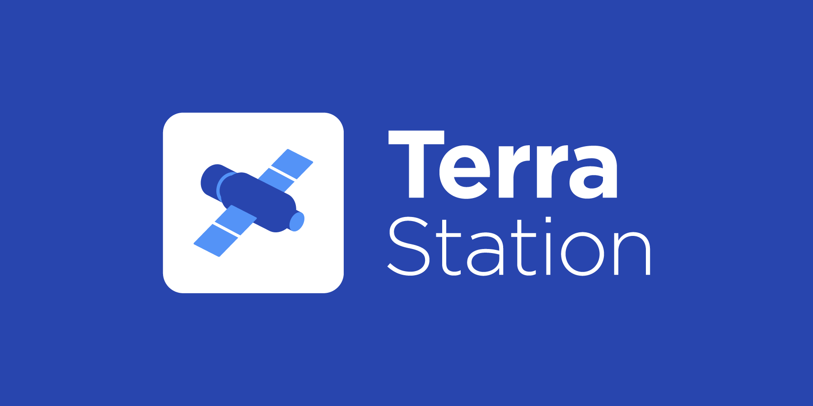

# Terra Station



**Terra Station** is a web application that enables you to interact with [Terra Core](https://github.com/terra-money/core).

Terra Station allows you to:

- View Terra’s key macroeconomic metrics displayed on a dashboard.
- Track the quantities and values of coins and tokens held in the connected wallet.
- Maintain a list of transactions made by the connected wallet.
- View and transfer NFTs from a custom list of NFT collections.
- Send tokens to another Terra wallet.
- Swap currencies on the Terra network at the effective exchange rate.
- Examine a detailed list of active validators on Terra.
- Stake LUNA by delegating it to your chosen validator and unstake it by removing your delegated LUNA.
- Earn rewards generated by staking LUNA.
- Participate in governance by voting on proposals and submitting your own.
- Upload and instantiate new contracts and query from and execute messages to existing contracts.
- Deposit and withdraw UST from Anchor Earn.

## Running Terra Station

Use the following information to set up Terra Station repositories for local development.
This project was bootstrapped with [Create React App](https://create-react-app.dev/).

Run the following commands:

```
git clone https://github.com/terra-money/station.git
cd station
npm i
npm run start
```

The app runs in development mode. To view Terra Station running locally, open https://localhost:3000 in a browser.

> :warning: For Windows user, you need to change the `SASS_PATH` inside your `.env` file.
> The value must be `SASS_PATH=./node_modules;./src/styles`
